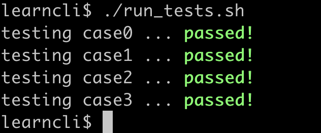

# Project

Now that you've familiarized yourself with the command line interface over the course of the semester, you will have the opportunity to build your own simple shell! But don't fret - when we say simple, we mean simple. The shell specified in this assignment is merely capable of changing directories and executing system programs such as `pwd` and `ls`. The goal of this assignment is to familiarize you with system-related library functions and to give you the pride of knowing that something you've been working with all semester is something that you could have built all along.

In particular, this project has two main goals:
1. Become more familiar with how the OS provides **process control** services that can be invoked by a user application. Specifically, your `shell` will use all three system calls: [fork](https://man7.org/linux/man-pages/man2/fork.2.html), [exec](https://man7.org/linux/man-pages/man3/exec.3.html), and [wait](https://man7.org/linux/man-pages/man2/wait.2.html).    
2. Become familiar with how a program can access a set of system **environment variables** using the [getenv](https://man7.org/linux/man-pages/man3/getenv.3.html) standard library function. In particular, here we'll access the `PATH` environment variable to determine if a program (i.e., executable object file) is located in a directory (defined in the PATH) on the file-system.


### Reading
* Process control:
  * [fork](https://man7.org/linux/man-pages/man2/fork.2.html) man page
  * [wait](https://linux.die.net/man/2/waitpid) man page
  * [exec](https://man7.org/linux/man-pages/man3/exec.3.html) man page
  * [Process API](https://pages.cs.wisc.edu/~remzi/OSTEP/cpu-api.pdf) OSTEP textbook
* Environment variables:
	* [getenv](https://man7.org/linux/man-pages/man3/getenv.3.html) man page

## Background

### Environment Variables

In this project, your shell program will use the `PATH` environment variable to determine if a file exists in a folder on your file-system. For example, if you execute the following command in your learncli docker environment

```
echo $PATH
```

the string shown below should be displayed in your terminal. **Note**: the `getenv("PATH")` function call in C would return the same string.

```
/usr/local/sbin:/usr/local/bin:/usr/sbin:/usr/bin:/sbin:/bin:/mnt/learncli/bin
```

In particular, folders in the PATH string are delimited by the `:` character. In this example, the PATH includes seven folders:
1. /usr/local/sbin
2. /usr/local/bin
3. /usr/sbin
4. /usr/bin
5. /sbin
6. /bin
7. /mnt/learncli/bin

We can now use this information to search for a file, let's say the program named `echo`, on the file-system. To do this, we simply create a new string by concatenating the `folder name` with the folder separator (`/`) and the `file name`. For example, 

```
/usr/local/sbin/echo
```
Then we could use the [stat](https://man7.org/linux/man-pages/man2/lstat.2.html) function to determine if the `echo` file exists in the `/usr/local/sbin` folder. For example

```
struct stat buff;

if ( stat("/usr/local/sbin/echo", &buff) == 0 && (S_IFREG & buff.st_mode) ) {
	// file named echo is in the /usr/local/sbin folder
} else {
	// file named echo is NOT in the /usr/local/sbin folder
}
```

This process can be repeated for each folder defined in the `PATH`. If the file cannot be found, then the file is not in any folder defined in the `PATH`. Very simple algorithm.


## Structure
<!-- #### Project Structure -->
Similar to Lab 06, you will implement a set of functions to be called by an external program. You **may not modify** the `main` function provided in the `project.c` source file to test the correctness of your shell program. See [Testing](#testing) section for information about how to test your program.

There are two starter files for this project: 
* `shell.h` header file and 
* `shell.c` source file. 

You **may not** add or remove global variables, alter the given function signatures, or add additional header files.

If you have any questions regarding this stipulation, you must ask your cohort leader for clarification.

The four main files included in this project are:
* `Makefile`- contains information used to compile your program with the `make` command. **Do not modify.**
* `project.c`- contains the main function, which is just a loop that reads in a command and uses the functions written in `shell.c` to determine whether the command is valid and handle it appropriately. Reading this file before you begin will help you understand the usage of functions you must implement. **Do not modify**.
* `shell.h`- includes declarations and specifications for all of the functions in `shell.c`. **Do not modify.**
* `shell.c`- contains function definitions for all functions in `shell.c`. You will fully implement, or modify, only the following functions listed below:
    * `allocate_mem_for_command`: Allocate memory for `command_t`.
    * `cleanup`: Free the memory allocated for `command_t`.
    * `parse` : Parse the command and its arguments
    * `find_fullpath`: Find the full path of the command.
    * `execute`: Execute command
    
In `shell.h` you will find the definition of a structure called `command_t` which contains two members: `argc` and `argv`. These are much like the `argc` and `argv` arguments of the `main` function in your C code.
```c
typedef struct {

  int argc;    // total number of arguments
  char** argv; // argument values (must malloc)

} command_t;
```

Lastly, there are **copious** amounts of comments in the `shell.h` header and `shell.c` source files. Read the comments carefully, they provide information needed to complete this assignment.

#### Source Files
In the shell.c source files, please be sure to format your PID as a single 9-digit number with no spaces nor
dashes. Additionally, be sure your capitalization and punctuation of the honor code pledge are correct.
```
// PID: 9DigitPidNoSpacesOrDashes
// I pledge the COMP211 honor code.
```

<!-- The Assignment -->
## Part 1: Allocating and Freeing

When the user inputs a command into your shell, the driver code (`project.c`) will call your `parse` function (which you will create in Part 2). This will allocate space on the heap to store the user input using the `allocate_mem_for_command` function. Then, after the command gets executed, the driver code will call the `cleanup` function to free up space for the next command.

Notice that the `command_t` struct contains the member `argv` which has the type `char**`. This represents a 2D array of characters (i.e. an array of strings). You will have to be careful when allocating (and freeing!) this member. See the slides on [Arrays, Strings, Pointers, and Memory Allocation](https://sakai.unc.edu/access/content/group/c4a561b6-4935-4144-b7ec-e02c9f576cf7/Lecture%20Slides/8_25_22.pdf) from 8/25 for more information. You can assume that the length of each argument will be no longer than `MAX_ARG_LENGTH`.

**Note**: You should *NOT* have the following code in your function: ```malloc(sizeof(command_t))```. Why is this? (Hint: Take a look at how `project.c` calls the `parse` function. Where does the `command` value live?) For the same reason, you should not call `free(p_cmd)` anywhere in your code.

## Part 2: Parsing

When the driver code (`project.c`) gets the command that was input by the user, it will call your `parse` function to parse the command. Given an array of all of the characters input by the user, you will need to call your `allocate_mem_for_command` function with the appropriate values. This will require you to figure out the value of `argc`.

Once the memory has been properly allocated, you will need to then copy the command and all of its arguments into the `argv` member of the command. The command and all of its arguments will be separated by one *or more* spaces. Additionally, there may be an arbitrary number of spaces at the beginning and/or at the end of the input. For example, the inputs `cd ..` and ` (4 spaces) cd (3 spaces) .. (5 spaces)` should result in the same `command_t` struct.

See the comments in `shell.c` for further examples.

## Part 3: Executing

Once the command has been parsed and stored in a `command_t` struct, it is ready to be executed. There are two types of commands that your shell will have to handle: built-in commands and non-built-in commands. A built-in command is one of `cd` or `exit` (this can be seen in the `BUILT_IN_COMMANDS` array located in `shell.c`). We have provided two functions to help you deal with built-in commands: `is_builtin` and `do_builtin`. For non-built-in commands, you will have to locate and execute an external program (see the [Background](#background) section above).

First, write the `find_fullpath` function. Many details about this function are provided in `shell.c`. You may want to look into the `strtok` function from the `string.h` library, but you are not required to do so.

Next, your `execute` function will have to determine whether or not the given command is built-in. If it is, you can use the `do_builtin` function mentioned above. If it is not, then you will have to use your `find_fullpath` function to find the full path of the external program, then use `fork`, `execv`, and `wait` as mentioned in the Process API slides ([fork and exit](https://sakai.unc.edu/access/content/group/c4a561b6-4935-4144-b7ec-e02c9f576cf7/Lecture%20Slides/11_3_22.pdf), [wait and exec](https://sakai.unc.edu/access/content/group/c4a561b6-4935-4144-b7ec-e02c9f576cf7/Lecture%20Slides/11_8_22.pdf)) to execute the command.

**Note**: If a command cannot be executed, i.e. if an executable could not be found, your shell should print out `Command '{command name}' not found!` For example, if you enter `thisisnotacommand` into your shell, you should see the response `Command 'thisisnotacommand' not found!`

## Testing

`project.c` will be the driver program that starts the shell.

#### Step 1. Compile Your code:
```
make
```
#### Step 2. Start the shell:
```
./project
```
You will see the following output:
```
learncli$ ./project
(0)$
```
When you see `(0)$` it means that you are in the shell program you write! You can execute the commands just like in the linux shell.

**You should execute your commands inside your shell.**

#### Step 3. Execute built-in commands. 

The built-in commands include `cd` and `exit`. Command `cd` and `exit` will be handled by the user program instead of a system call.

For example:
```
pwd
cd ..
pwd
exit
```

In this series of commands, you will 
1. `pwd`: print the current working directory.
2. `cd ..`: execute the built-in command to change the working directory to its parent directory.
3. `pwd`: print the current working directory.
4. `exit`: execute the built-in command to exit the program.

You will see the following outputs in the terminal. Your working directory may be different from the example output below.

```
learncli$ ./project
(0)$ pwd
/mnt/learncli/workdir/project/ 
(1)$ cd ..
(2)$ pwd
/mnt/learncli/workdir/
(3)$ exit
learncli$
```

#### Step 4. Execute external commands
All the commands except `cd` and `exit` are external commands which are executed by a system call using the `execv` function in c.

If you didn't start your shell program or you exited it, you need to start the shell program first:
```
./project
```

##### Simple commands
Let's try some external commands. For example:

```
ls
tail -n 3 Makefile
```
`ls` will list all the files and directories inside the current working directory. `tail -n 3 Makefile` will print the last 3 lines in Makefile.

You will see something like the following outputs:
```
learncli$ ./project
(0)$ ls
figs Makefile project project.c project.o README.md run_tests.sh shell.c shell.h shell.o test_data
(1)$ tail -n 3 Makefile

run:
	./project
(2)$
```

#### Test your code

##### 1. Test manually

Like the previous labs, you can test your code using the given test cases using 
```
./project < test_data/case{0,1,2,3}/input
```

For example,
```
learncli$ ./project < test_data/case0/input
hello
(0)$ (1)$ learncli$
```

The correct output is inside `test_data/case{0,1,2,3}/output`. You can compare the correct outputs with yours using the following command:

```
./project < test_data/case0/input > test_data/case0/my_output
diff -s test_data/case0/output test_data/case0/my_output
```

##### 2. Test all the cases automatically

You can test all the cases using the following commands:
```
make
./run_tests.sh
```

If you passed all the test cases, You would see the following output:



**Think about edge cases for each function, they will be tested by the autograder.**

## Submit your assignment
1. Use git to push your finished code to this GitHub repository.
2. Go to the COMP 211 course in GradeScope and click on the assignment called **Project**.
3. Click on the option to **Submit Assignment** and choose GitHub as the submission method.
4. You should see a list of your public repositories. Select the one named **project-yourname** and submit it.
5. Your assignment should be autograded within a few seconds and you will receive feedback for the autograded portion.
6. If you receive all the points, then you have completed this project! Otherwise, you are free to keep pushing commits to your GitHub repository and submit for regrading up until the deadline of the project.

## Grading
### Autograder tests (8 pts)
Remember, you can submit as many times as you like before the due date to get full credit.

### Style (2pts)
* Variable Names (.5 pts)
	* Single-character variable names are only used for counting/indexing, or when used to represent a variable whose type has only one instance.
	* All "magic numbers" are defined as constants.
	* Variable names are either related to the usage of the variable, or the meaning is commented.
	* No unused variables are declared.
* Readability (.75 pts)
	* Proper indentation (use the following Vim trick: (1G=G) )
	* Consistent whitespace theme used throughout.
	* Logically distinct blocks of code are separated by whitespace.
	* No more than two consecutive lines of empty whitespace.
	* No old debug code is present (including in the comments).
* Correctness of Code (.75 pts)
	* For all functions (including main if applicable), every path of execution leads to a return statement.
	* No libraries are included that weren't provided in the starter code or mentioned in the README.

We reserve the right to deduct points from the autograder if we notice that you have hard-coded any test cases and not actually fully implemented the functions.

